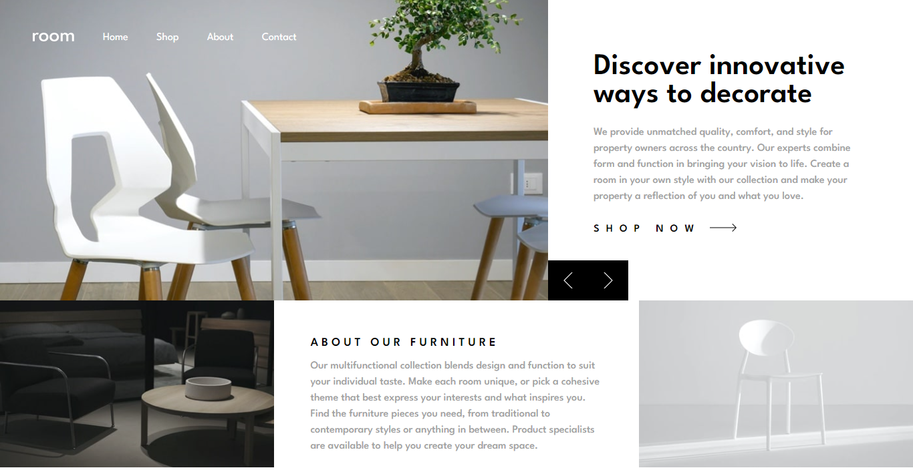

# Frontend Mentor - Blog preview card solution

This is a solution to the [Blog preview card challenge on Frontend Mentor](https://www.frontendmentor.io/challenges/blog-preview-card-ckPaj01IcS). Frontend Mentor challenges help you improve your coding skills by building realistic projects. 

## Table of contents

- [Overview](#overview)
  - [The challenge](#the-challenge)
  - [Screenshot](#screenshot)
  - [Links](#links)
- [My process](#my-process)
  - [Built with](#built-with)
  - [What I learned](#what-i-learned)
  - [Continued development](#continued-development)
  - [Useful resources](#useful-resources)
- [Author](#author)
- [Acknowledgments](#acknowledgments)


## Overview

### The challenge

Users should be able to:

- See hover and focus states for all interactive elements on the page

### Screenshot




### Links

- Solution URL: [amankumar1222](https://github.com/amankumar1222/room-homepage-master)
- Live Site URL: [room page master](https://65ec250ccda6dc7a85d2787b--stunning-llama-d80fe8.netlify.app/#)

## My process


### Built with

- Semantic HTML5 markup
- CSS custom properties
- Flexbox
- Mobile-first workflow


### What I learned

In this project i learnt Box-Shadow in dept.


```css
.proud-of-this-css {
      box-shadow: hsl(0, 0%, 7%) 1.25px 1.25px,
        hsl(0, 0%, 7%) 2.5px 2.5px,
        hsl(0, 0%, 7%) 3.75px 3.75px,
        hsl(0, 0%, 7%) 5px 5px,
        hsl(0, 0%, 7%) 6.25px 6.25px;
}
```


### Continued development

Now days i am practicing and learning css html js so i want to make some project for gaining some confident 


### Useful resources


## Author

- Website - [Aman kumar](In Progress)
- Frontend Mentor - [@amankumar1222](https://www.frontendmentor.io/profile/amankumar1222)
- Twitter - [@Amankumar](...)


## Acknowledgments

This is where you can give a hat tip to anyone who helped you out on this project. Perhaps you worked in a team or got some inspiration from someone else's solution. This is the perfect place to give them some credit.


